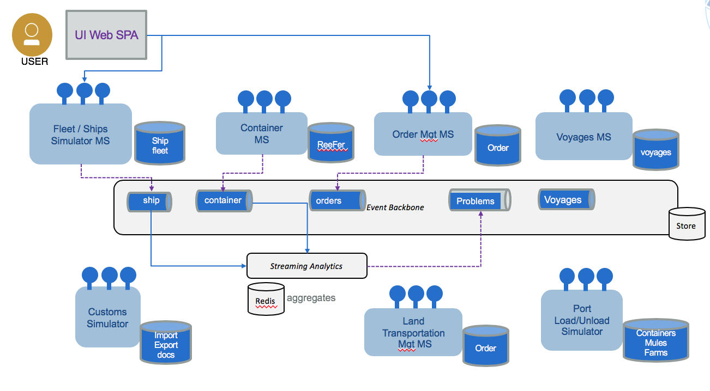

# K Container Shipment Use Case
This solution implementations illustrates the deployment of real time analytics on event streams in the context of container shipment.

As part of producing the IBM event driven point of view and reference architecture  we wanted to bring together a complete scenario which would cover all aspects of  developing an event driven solutions including extended connections to devices/IOT  and blockchain for trusted business trading networks. We felt that the  shipping business could provide a good foundation for this and would enable us to show how to  develop event driven solutions  following the architecture patterns.
The high level process can be represented in the following diagram, we will describe the steps in the [use case section](#use-case-description):

In developing the scenario, it became apparent that the event driven nature of business, extends across the business network, so we have widened the view in the scenario to consider  the chain of parties  involved in the shipping process, including importer, exporter, land transport and customs. To keep the scenario easy to understand , we have only considered the following case:

1. Importer Orders goods from Exporter
2. Exporter becomes the  customer of the shipping agent  and uses To Door shipping  
3. Shipping agent manages process of land transport customs  loading, unloading and shippingThrough the scenario we can see the impact of “events”,  which may delay or change the shipping process across all three parties.  

## Table Of Content

* [Target Audiences](#target-audiences)
* [Use case description](#use-case-description)
* [Analysis](#analysis-outcomes)
* [Architecture](#architecture)
* [Deployment](#deployment)
* [Demonstration script](./docs/demo.md)

## Target Audiences

You will be greatly interested by the subjects addressed in this solution if you are...
* an architect, you will get a deeper understanding on how all the components work together, and how to address resiliency, high availability.
* a developer, you will get a broader view of the solution end to end and get existing starting code, and practices you may want to reuse during your future implementation. We focus on event driven solution in hybrid cloud addressing patterns and non functional requirements as CI/CD, Test Driven Development, ...
* a project manager, you may understand all the artifacts to develop in an EDA solution, and we may help in the future to do project estimation.

## Use Case Description

## Analysis Outcomes

Using the [event storming](https://github.com/ibm-cloud-architecture/refarch-eda/blob/master/docs/methodology/readme.md) workshop the development team extracts the following analysis of the business domain.

## Architecture

Leveraging the Event Driven Architecture high level architecture foundation the solution is using the following components:

* Top left represents the user interface to support the demonstration of the KC solution, with a set of widgets to present the ships movements, the container tracking / monitoring and the event dashboards. The botton of the UI will have controls to help doing a step by step demonstration.
* The event backbone is used to defined a set of topics used in the solution and as event sourcing for microservice to microservice data consistency support.
* Each service will support the top level process with context boundary defining the microservice scope.
* Streamaing analytics is used to process aggreates and analytics on containers and ships data coming in real time.

## Deployment
The solution support a set of related repositories including user interface, a set of microservices to implement event sourcing, saga and SQRS patterns, and provides simulators and analytics content. 

### Related repositories
* [User Interface and BFF for demonstration](https://github.com/ibm-cloud-architecture/refarch-ks-ui)
* [Supporting microservices and functions](https://github.com/ibm-cloud-architecture/refarch-ks-ms)
* [Real time analytics with IBM Streams](https://github.com/ibm-cloud-architecture/refarch-ks-streams)

### Configuration
To make the solution running we need to have a set of components ready and installed.

## Devops

## Contribute
As this implementation solution is part of the Event Driven architeture reference architecture, the [contribution policies](https://github.com/ibm-cloud-architecture/refarch-eda#contribute) apply the same way here.

Please [contact me](mailto:boyerje@us.ibm.com) for any questions.
