# Demo Script 

This demo script is using the localhost deployment with a mapping of the host name kcsolution to localhost defined in the `/etc/hosts` file. For IBM Cloud change the hostname accordingly. 

Here is how to execute the business process step by step:

## Step 1: Manufacturer create an order:
* Go to the http://kcsolution:3110 URL to access the demonstration home page:

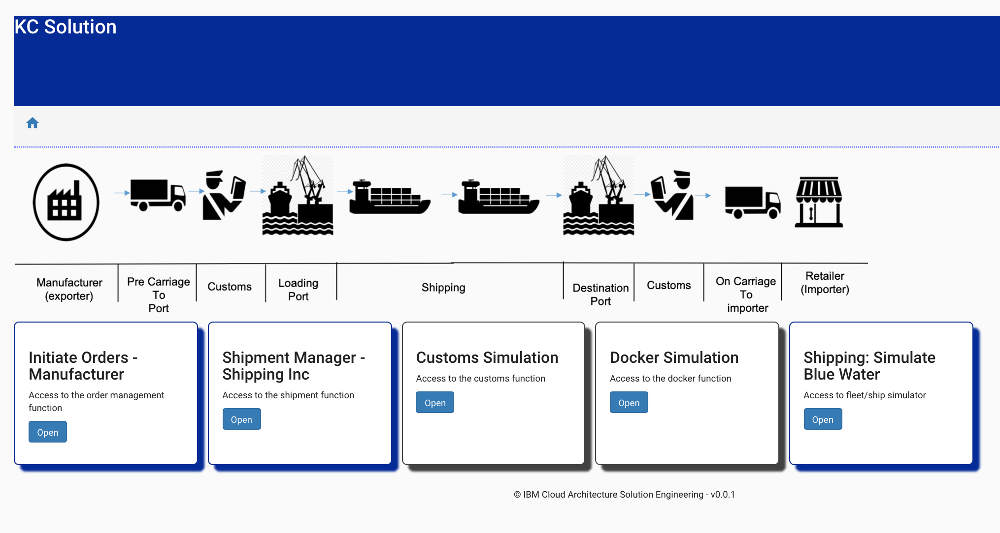

This page presents the process and some tiles that can be used to simulate the progression within the business process. The grey shadowed tiles are not actives. 

From the `Initiate Orders - Manufacturer` we can have the manufacturer creating a new fresh product order to ship over sea.

To represent different manufacturer the first select box is used to support different scenarios in the future. GoodManufacturer can be used. 

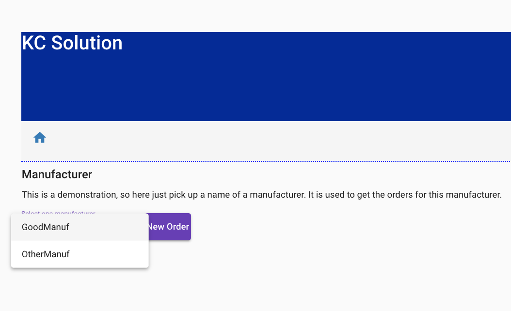

Then a list of existing orders may be displayed. You can add order with the UI, but you can also use a script in the order command microservice project: https://github.com/ibm-cloud-architecture/refarch-kc-order-ms/blob/master/order-command-ms/scripts/createOrder.sh

Here is an example to add an order to get a voyage from Oakland to Shanghai:
```
./createOrder.sh localhost:10080 ./orderOacklandToChinaCreateonso

```

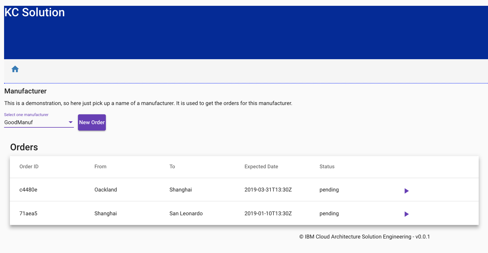

> There is a lot happening here. The Angular is getting orders using the [orders.service.ts](https://github.com/ibm-cloud-architecture/refarch-kc-ui/blob/master/ui/src/app/features/orders/orders.service.ts) service from the BFF at the address: `http://localhost:3010/api/orders`.  
The BFF is calling the [Order Query Microservice](https://github.com/ibm-cloud-architecture/refarch-kc-order-ms/tree/master/order-query-ms) via a javascript client code: [getOrders(manuf) function.](https://github.com/ibm-cloud-architecture/refarch-kc-ui/blob/4b9d7d1241eaeeaee7fc01247a35b696f0b6d5b2/server/routes/OrderClient.ts#L12-L25). The Order Query microservice URL is defined in environment variable or defaulted in the config file. It is mapped to the deployed Order service. (e.g. http://ordercmd:9080/orders)

Selecting one order using the `Arrow` icon open the details of the order:


As illustrated in the CQRS diagram:


the creation of the order goes to the [order command microservice](https://github.com/ibm-cloud-architecture/refarch-kc-order-ms/tree/master/order-command-ms) which publishes a `OrderCreated` event to the `orders` topic and then consumes it to persist the data to its database. See [source code here](https://github.com/ibm-cloud-architecture/refarch-kc-order-ms/blob/6de424c443c05262ae013620f5f11b4a1b2e6f90/order-command-ms/src/main/java/ibm/labs/kc/order/command/service/OrderCRUDService.java#L51-L74)


If you plug a orders consumer you can see the following trace wiht the status of the order being `pending` and the type of event being `OrderCreated`
```json
{"payload":{
    "orderID":"1fcccdf2-e29d-4b30-8e52-8116dc2a01ff",
    "productID":"Carrot",
    "customerID":"GoodManuf",
    "quantity":10000,
    "pickupAddress": "...",
    "expectedDeliveryDate":"2019-03-31T13:30Z",
    "status":"pending"},
"type":"OrderCreated",
"version":"1"}

```

## Step 2: K Container Shipment Manager looking at Orders

From the home page goes to the Shipment Inc tile:

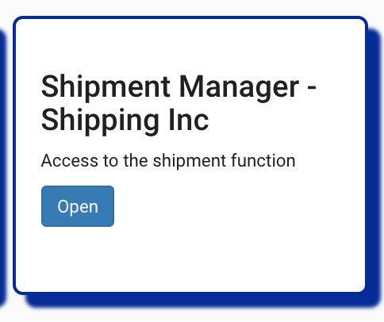 

Then the home page lists the current order the shipment company received

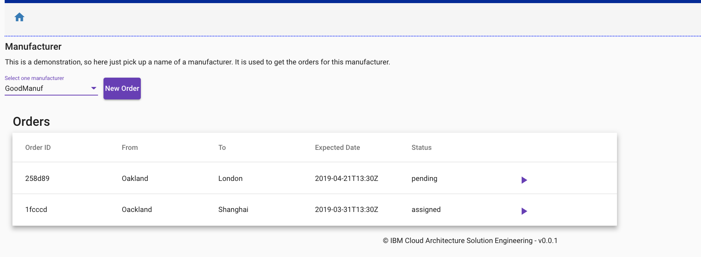

The status of those events will be modified over time while the order is processed down stream by the voyage and container services. The following sequence diagram illustrates the flow:

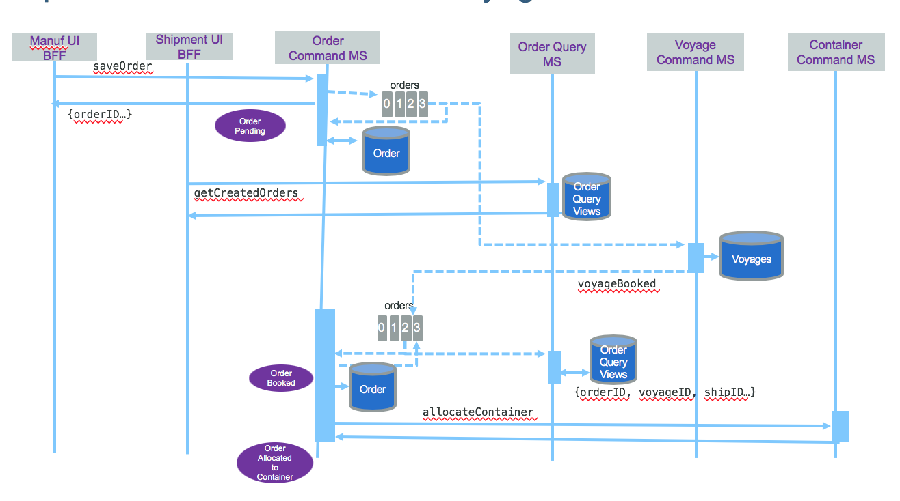  

Looking at the traces in the voyage service
```
voyages_1     |  emitting {"timestamp":1548788544290,"type":"OrderAssigned","version":"1","payload":{"voyageID":100,"orderID":"1fcccdf2-e29d-4b30-8e52-8116dc2a01ff"}}
```

or at the `orders` topic:

```json
{"timestamp":1548792921679,
"type":"OrderAssigned","version":"1",
"payload":{"voyageID":100,"orderID":"1fcccdf2-e29d-4b30-8e52-8116dc2a01ff"}}

```

## Step3: Simulate the ship in blue water

From the home page goes to the `Simulate the bluewater` tile, then in the main page select one of the available fleet. Only the North Pacific has data as of now:

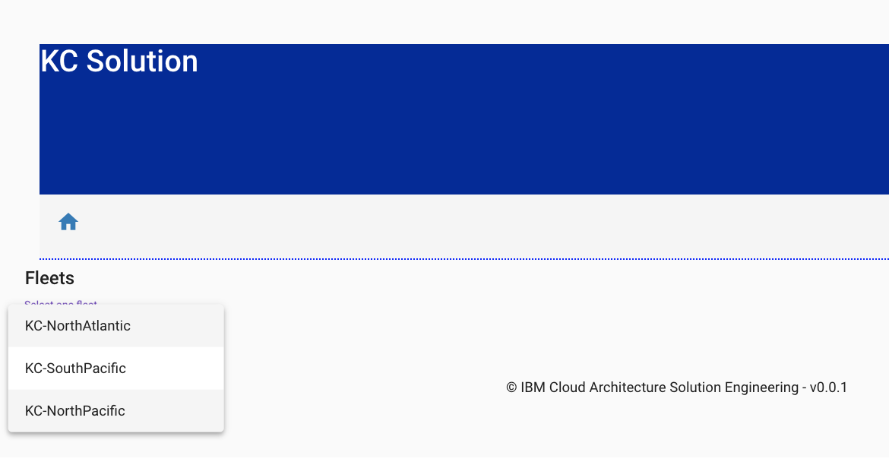  

The fleet panel lists the boats, their location and status and a map:

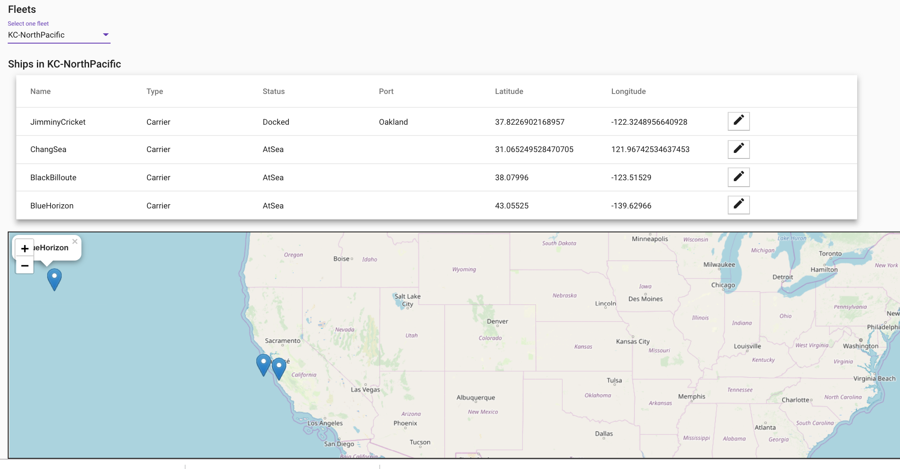  

Selecting one boat with the edit button, goes to the boat detail view:

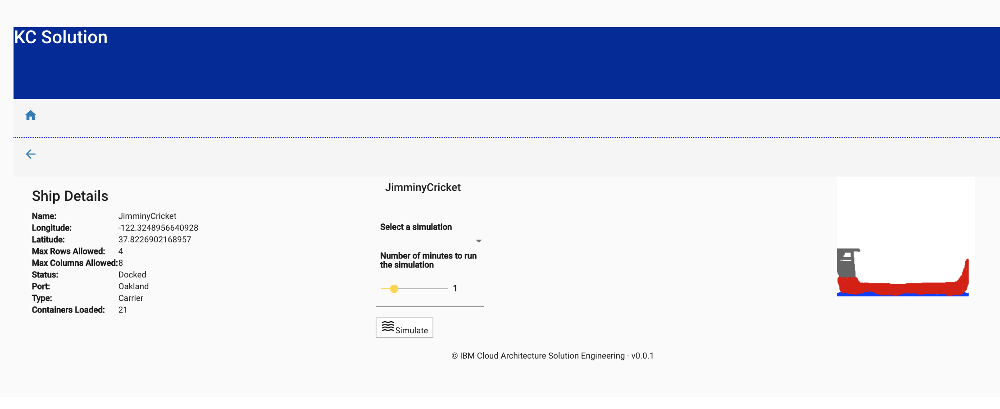  

You can start the simulation on the ship movement by seleting one of the three pre-defined scenarios:
* Fire some containers
* One reefer down
* Or boat going thru a heat waves

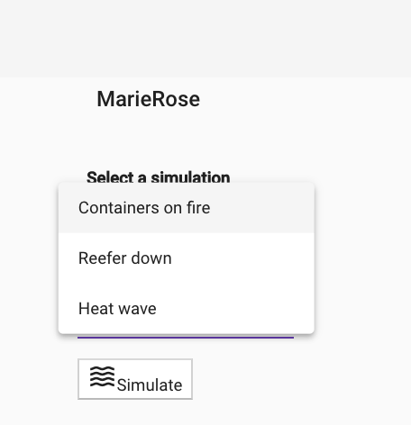  

The command is sent to the Simulator and the boat will start to move and generate container metrics:

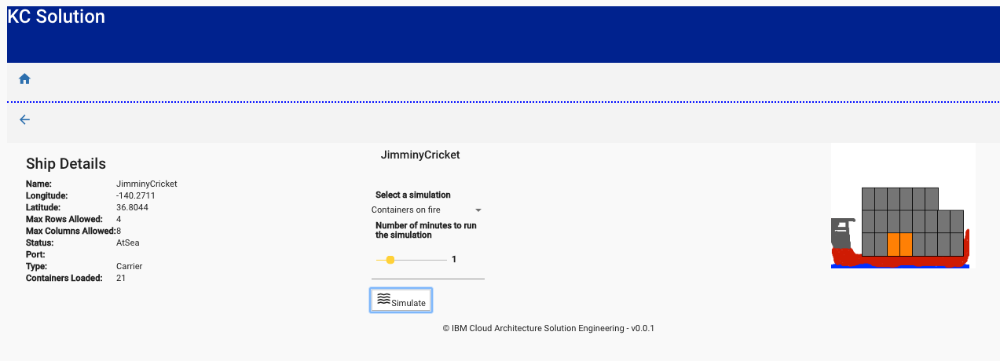  

The simulation implementation is yet not completed. 


