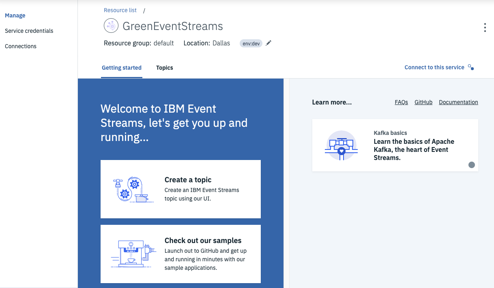
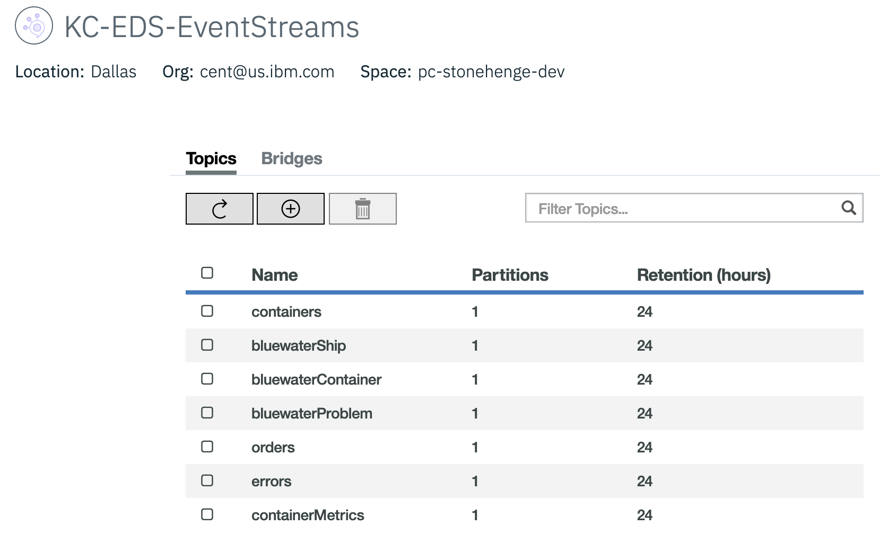
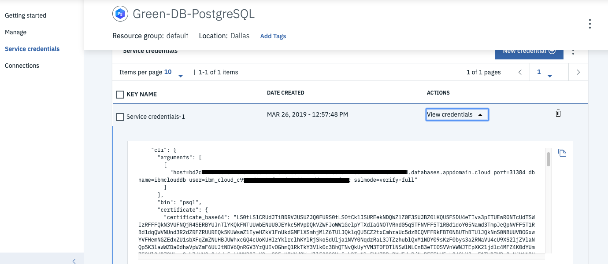

# Deployment of backing services for the Event-Driven Architecture Reference Application

## Kafka & Event Streams

### Using IBM Event Streams, hosted on IBM Cloud

## Event Streams Service on IBM Cloud

To provision your service, go to the IBM Cloud Catalog and search for `Event Streams`. It is in the *Integration* category. Create the service and specify a name, a region, and a resource group. Once the service is created you reach the Event Stream Standard Dashboard:




We will use a kubernetes secret to define the api key (see detail [in this section](#using-api-keys))

* In the *Manage* panel add the topics needed for the solution. We need at least the following:

 

See also [this note](https://ibm-cloud-architecture.github.io/refarch-eda/deployments/eventstreams/es-ibm-cloud/) for the enterprise plan and advanced topic creation.

* In the service credentials create new credentials to get the Kafka broker list, the admim URL and the api_key needed to authenticate the consumers or producers.

 


 ### Event stream API key

 The Event streams broker API key is needed to connect any deployed consumers or producers within kubernetes cluster to access the service in IBM Cloud. To avoid sharing security keys, we propose to define a kubernetes secret and deploy it to the IKS cluster.

 * Define a Event Stream API key secret: to use Event Streams, we need to get the API key and configure a secret under the `browncompute` namespace.

 ```shell
 kubectl create secret generic eventstreams-apikey --from-literal=binding='<replace with api key>' -n browncompute
 ```

 * Verify the secrets:

 ```
 kubectl describe secrets -n browncompute
 ```

 This secret is used by all the solution microservices which are using Kafka / Event Streams. The detail of how we use it with environment variables, is described in one of the project [here.](https://github.com/ibm-cloud-architecture/refarch-kc-ms/blob/master/fleet-ms/README.md#run-on-ibm-cloud-with-kubernetes-service)


### Using IBM Event Streams, deployed on the IBM Cloud Pak for Integration

#### Installation

The installation is documented in the product documentation **LINK** and in our [own note here.](https://ibm-cloud-architecture.github.io/refarch-eda/deployments/eventstreams/)

#### Configure topics and secrets

To access the console, connect to the ICP console and select the deployment named something like: "*-es-ui-deploy" under the `streams` namespace.

### Topics

You can create the topics using the Event Streams console:


or the use a set of commands like below, which are done for you in the script: `scripts/createLocalTopicsOnK8S.sh `.

```shell
# get the name of the Kafka pod
$ kubectl get pods  -n streams | grep kafka | awk '{print $1;}'
> rolling-streams-ibm-es-kafka-sts-0
rolling-streams-ibm-es-kafka-sts-1
rolling-streams-ibm-es-kafka-sts-2
# Then get the name of the zookeeper service:
$ kubectl get svc -n streams | grep zoo | awk '{print $1;}' | head -1
rolling-streams-ibm-es-zookeeper-fixed-ip-svc-0
# Then remote exec a shell on one of this broker to configure the topic - for example the "orders" topic
$ kubectl exec -n streams  -ti rolling-streams-ibm-es-kafka-sts-0   -- bash -c "/opt/kafka/bin/kafka-topics.sh --create  --zookeeper $zooksvc:2181 --replication-factor 1 --partitions 1 --topic orders"
```

### API Key

Define an API key using the Event Stream Console. You can specify keys at the topic and consumer group levels or use a unique key for all topics and all consumer groups. Once you have the API key, define a `secret` named "eventstreams-apikey" with the command:

```shell
 $ kubectl create secret generic eventstreams-apikey --from-literal=binding='<api-key>' -n greencompute
 $ kubectl describe secrets -n greencompute
```
This `eventstreams-apikey` secret will be used in the Helm chart settings and kubernetes deployment descriptor (see [this section](#code-considerations) later in this article).

### Using community-based Kafka Helm charts, deployed locally in-cluster

Add Bitnami Helm Repository:

```
helm repo add bitnami https://charts.bitnami.com/bitnami
```

Be sure to have updated the helm repository with:

```
helm repo update
```

## Setting up Kafka and Zookeeper

* Create a namespace.

```
  kubectl create namespace greencompute
```

* Deploy kafka and zookeeper using bitnami/kafka helm

  ```
  helm install --name kafka --set persistence.enabled=false bitnami/kafka --namespace greencompute
  ```

It will take minutes to get the 2 pods ready.

* Create the needed kafka topics

  ```
  ./scripts/createMinikubeLocalTopics.sh
  ```

  Get the kafka pod name:

  ```
  export POD_NAME=$(kubectl get pods --namespace greencompute -l "app.kubernetes.io/name=kafka,app.kubernetes.io/instance=kafkabitnami,app.kubernetes.io/component=kafka" -o jsonpath="{.items[0].metadata.name}")
  ```

  Get the list of topics

  ```
  kubectl exec  -ti $POD_NAME  -n greencompute -- kafka-topics.sh --list --zookeeper kafkabitnami-zookeeper:2181
  ```

## Postgres

### Using Postgresql, hosted on IBM Cloud

[postgresql](https://cloud.ibm.com/catalog/services/databases-for-postgresql)

## The postgresql service

The container manager microservice persists the Reefer container inventory in postgresql. To install the service follow the [product documentation here](https://cloud.ibm.com/catalog/services/databases-for-postgresql).

> If you do not plan to use this container manager service you do not need to create a Postgresql service.

When the service is configured, you need to create some credentials and retreive the following values for the different configurations:

* postgres.username
* postgres.password
* postgres.composed which will be map to a JDBC URL.




#### Getting the certs for IBM CLoud PostgreSQL

!!! warning
    If you run with postgresql running locally, you have nothing to do.

If you run the container microservice connected to Postgresql running on IBM Cloud, you need to get the SSL certificate. To do so perform the following commands:

* From the IBM Cloud Console get the name of your postgresql service
  For example the name we have is: Green-DB-PostgreSQL
* Then get the certificates

```
ibmcloud cdb deployment-cacert <your-PostgreSQL-service-name> > postgresql.crt
# if you do not have the cloud database plugin does the following and rerun previous command:
ibmcloud plugin install cloud-databases
```

* Transform the certificate format

```
openssl x509 -in postgressql.crt -out postgressql.crt.der -outform der
```

* Save it in Java keystore

```
keytool -keystore clienttruststore -alias postgresql -import -file postgressql.crt.der -storepass changeit
```

* Create required secrets.

```
kubectl create secret generic postgresql-url --from-literal=binding='jdbc:postgresql://postgre-db-postgresql:5432/postgres' -n greencompute

kubectl create secret generic postgresql-user --from-literal=binding='postgres' -n greencompute

kubectl create secret generic postgresql-pwd --from-literal=binding='supersecret' -n greencompute
```


### Postgresql URL, User, PWD and CA certificate as secrets

Applying the same approach as above, copy the Postgresql URL as defined in the Postegresql service credential and execute the following command:
```
kubectl create secret generic postgresql-url --from-literal=binding='<replace with postgresql-url>' -n browncompute
```

For the user:

```
kubectl create secret generic postgresql-user --from-literal=binding='ibm_cloud_c...' -n browncompute
```

For the user password:

```
kubectl create secret generic postgresql-pwd --from-literal=binding='<password from the service credential>.' -n browncompute
```

For the SSL certificate:

* Get the certificate using the name of the postgresql service:

```
ibmcloud cdb deployment-cacert $IC_POSTGRES_SERV > postgresql.crt
```

* Then add it into an environment variable

```
export POSTGRESQL_CA_PEM="$(cat ./postgresql.crt)"
```

* Then define a secret:

```
kubectl
create secret generic postgresql-ca-pem --from-literal=binding="$POSTGRESQL_CA_PEM" -n browncompute
```

Now those variables and secrets are used in the deployment.yml file of the service that needs them. Like the Springboot container microservice. Here is an example of such settings:

```yaml
- name: POSTGRESQL_CA_PEM
  valueFrom:
    secretKeyRef:
      name: postgresql-ca-pem
      key: binding
- name: POSTGRESQL_USER
  valueFrom:
    secretKeyRef:
      name: postgresql-user
      key: binding
- name: POSTGRESQL_PWD
  valueFrom:
    secretKeyRef:
      name: postgresql-pwd
      key: binding
```


### Using community-based Postgresql Helm charts, deployed locally in-cluster

## Pre-requisites

See the common pre-requisites from [this note](../pre-requisites.md).


Add Bitnami Helm Repository:

```
helm repo add bitnami https://charts.bitnami.com/bitnami
```

Be sure to have updated the helm repository with:

```
helm repo update
```

### Deploy postgresql using Helm

!!! warning
    Deploy postgresql only if you plan to use the container-ms service.

```
helm install --name postgre-db \
  --set postgresqlPassword=supersecret \
  --set persistence.enabled=false \
    stable/postgresql --namespace greencompute
```

Once the pod is running access to the password using

```
export POSTGRES_PASSWORD=$(kubectl get secret --namespace greencompute postgre-db-postgresql -o jsonpath="{.data.postgresql-password}" | base64 --decode)
```

And then use the `psql` command line interface to interact with postgresql. For that we are using a docker image as client to the postgresql server running in Minikube:

```
kubectl run postgre-db-postgresql-client --rm --tty -i --restart='Never' --namespace greencompute --image docker.io/bitnami/postgresql:11.3.0-debian-9-r38 --env="PGPASSWORD=$POSTGRES_PASSWORD" --command -- psql --host postgre-db-postgresql -U postgres -p 5432
```

The two above commands are defined in the bash script named `scripts/startPsql.sh`.

!!! note
    `psql` will be use to verify tests execution

Also to connect to your database from outside the cluster execute the following commands:

```
    kubectl port-forward --namespace greencompute svc/postgre-db-postgresql 5432:5432 &
    PGPASSWORD="$POSTGRES_PASSWORD" psql --host 127.0.0.1 -U postgres -p 5432
```
