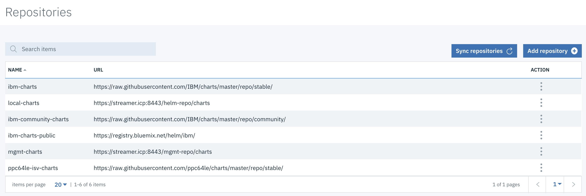
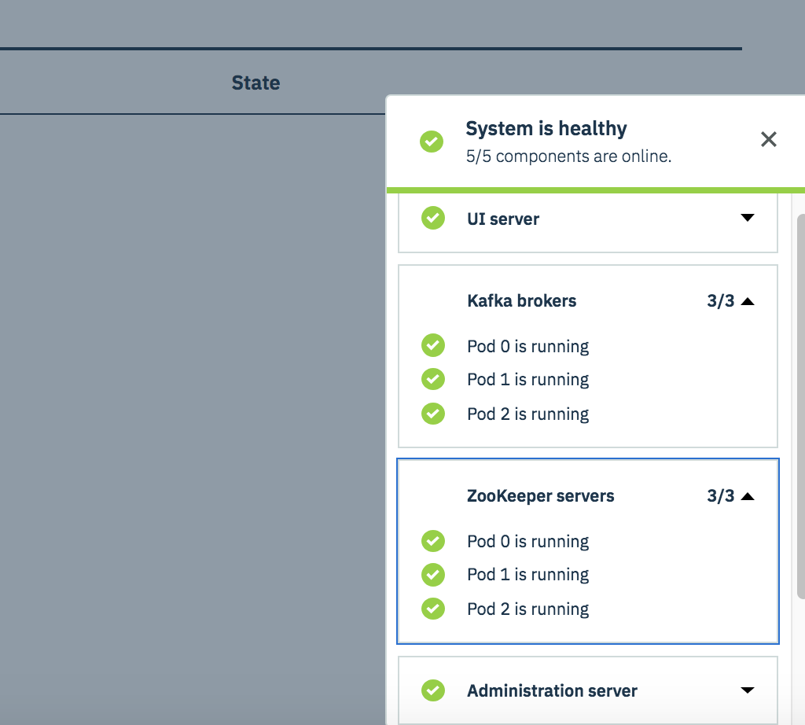

# Prepare IBM Cloud Private to run the solution

## Install Event Streams on ICP

The installation is documented in the product documentation and in our [own note here.](https://ibm-cloud-architecture.github.io/refarch-eda/deployments/eventstreams/)

If not done go to the console 'toolbox tab' and download the Event Streams CLI and install it on top of ICP CLI using `cloudctl plugin install ./es-plugin`. Once installed, the IBM Event Streams CLI is invoked using `cloudctl es`.

## Configure topics and secrets

To access the console, connect to the ICP console and select the deployment named something like: "*-es-ui-deploy" under the `streams` namespace. You can create the topics using the Event Streams console

  

 or the use a set of commands like below, which is done in the `scripts/createLocalTopicsOnK8S.sh ` 

```shell
# get the name of the Kafka pod
$ kubectl get pods  -n streams | grep kafka | awk '{print $1;}'
> rolling-streams-ibm-es-kafka-sts-0                              
rolling-streams-ibm-es-kafka-sts-1                               
rolling-streams-ibm-es-kafka-sts-2
# Then get the name of the zookeeper service:
$ kubectl get svc -n streams | grep zoo | awk '{print $1;}' | head -1
rolling-streams-ibm-es-zookeeper-fixed-ip-svc-0
# Then remote exec a shell on one of this broker to configure the topic - for example the "orders" topic
$ kubectl exec -n streams  -ti rolling-streams-ibm-es-kafka-sts-0   -- bash -c "/opt/kafka/bin/kafka-topics.sh --create  --zookeeper $zooksvc:2181 --replication-factor 1 --partitions 1 --topic orders"
```


Define an API key. You can specify keys at the topic and consumer group levels or use a unique key for all topics and all consumer groups. Once you have the API key define a `secret` named "eventstreams-apikey" with the command:

```shell
 $ kubectl create secret generic eventstreams-apikey --from-literal=binding='<api-key>' -n greencompute
 $ kubectl describe secrets -n greencompute
```

## Private docker registry

When deploying ICP, operators can define a private registry that will be used to host the docker images created. To get the URL goes to the ICP console, then Manage > Helm repositories (e.g. https://streamer.icp:8443/helm-repo/charts). 



## Namespace

Create a namespace to isolate the application within the solution. (e.g. greencompute)

```shell
$ kubectl get namespaces
NAME           STATUS    AGE
cert-manager   Active    42d
default        Active    42d
greencompute   Active    18d
ibmcom         Active    42d
istio-system   Active    42d
kube-public    Active    42d
kube-system    Active    42d
platform       Active    42d
services       Active    42d
streams        Active    42d
```

## Common deployment configuration

The repository name will be different if we deploy on IKS and ICP, also on IKs there is a password and api to access the registry that are persisted in a k8s secret. 

When deploying kafka consumer it is important to assess the horizontal pod autoscaler settings and needs, as adding consumers will not address scalability if the number of partitions in the topic(s) to consume does not match the increase of consumers. So disable HPA by default. If you want to use HPA you also need to ensure that a metrics-server is running, then set the number of partition, and the `hpa.maxReplicas` to the number of partitions. 

## Generic deployment process

* Login to the IBM Cloud private instance (execute `./scripts/icp-login.sh`)
* Build or tag the docker image with the cluster name and namespace (e.g. `streamer.icp:8500/greencompute/kc-containerkstreams`)
* Login to docker registry: `docker login streamer.icp:8500`
* Push the image to the repo: `docker push streamer.icp:8500/greencompute/<imagename>:<version>`
* Deploy the helm release: `helm install <release> --name <releasename> --namespace greencompute --tls`

Specific:

* Container microservice - [kstreams implementation](https://github.com/ibm-cloud-architecture/refarch-kc-container-ms/tree/master/kstreams)  
`helm install icpcontainerkstreams/ --name container-kstreams --namespace greencompute --tls`

## Resilience

A microservice needs to be resilient to failures and to be able to restart often on another machine for availability. In the case of kafka we address, in [this note](https://ibm-cloud-architecture.github.io/refarch-eda/kafka/readme/#high-availability-in-the-context-of-kubernetes-deployment), the fact that we need anti-affinity rules to get brokers running on different nodes, and be sure to have at least 3 brokers running in parallel. For Zookeepers be sure to have at least 3 instances and co located with a broker. 



There are three stateful set defined in the deployed event streams products as illustrated below:
```shell
$ kubectl get sts -n streams
NAME                               DESIRED   CURRENT   AGE
rolling-streams-ibm-es-elas-ad8d   2         2         40d
rolling-streams-ibm-es-kafka-sts   3         3         40d
rolling-streams-ibm-es-zook-c4c0   3         3         40d
```

Also a `kubectl describe nodes` execution will show the clear allocation of kafka pods on the 3 worker nodes"

```
ExternalID:                  xxxxxxxx.170
Non-terminated Pods:         (11 in total)
Namespace             Name             CPU Requests  CPU Limits   Memory Requests  Memory Limits
---------             ----             ------------  ----------   ---------------  -------------
        0 (0%)
streams    rolling-streams-ibm-es-kafka-sts-2     1 (12%)       1 (12%)      3548Mi (11%)     3548Mi (11%)
streams    rolling-streams-ibm-es-zook-c4c0-2     100m (1%)     100m (1%)    750Mi (2%)       1Gi (3%)

ExternalID:                  xxxxxxxx.65
Non-terminated Pods:         (14 in total)
  
streams    rolling-streams-ibm-es-kafka-sts-1     1 (12%)       1 (12%)  3548Mi (11%)   3548Mi (11%)
streams    rolling-streams-ibm-es-zook-c4c0-1     100m (1%)     100m (1%)  750Mi (2%)     1Gi (3%)

ExternalID:                  xxxxxxx.127
Non-terminated Pods:         (14 in total)
streams    rolling-streams-ibm-es-kafka-sts-0    1 (12%)       1 (12%)     3548Mi (11%)     3548Mi (11%)
streams    rolling-streams-ibm-es-zook-c4c0-0    100m (1%)     100m (1%)   750Mi (2%)       1Gi (3%)
```

So how to ensure resiliency for consumer and producer? We are addressing in separate the discussions for [consumer](https://ibm-cloud-architecture.github.io/refarch-eda/kafka/consumers/) and [producer](https://ibm-cloud-architecture.github.io/refarch-eda/kafka/producers/).

###  Monitoring

There are two liveness mechanisms in kubernetes, the readiness (is the service ready to receive requests?) and the liveness (is the container running?). In case of readiness failure the service is removed from the available end points, while in case of liveness failure the container is restarted.

In kafka there are others things to consider. For liveness an open port responding should be fine. For readiness we want to verify if the replicas are working, or the borkers are not overloaded, and may be when there is degradation it should not accept more connections. Below is an extract of the statefulset for monitoring the kafka containers:

```json
"containers": [
          {
            "name": "kafka",
            "livenessProbe": {
              "httpGet": {
                "path": "/liveness",
                "port": 7070,
                "scheme": "HTTP"
              },
              "initialDelaySeconds": 360,
              "timeoutSeconds": 1,
              "periodSeconds": 15,
              "successThreshold": 1,
              "failureThreshold": 3
            },
            "readinessProbe": {
              "httpGet": {
                "path": "/readiness",
                "port": 7070,
                "scheme": "HTTP"
              },
              "initialDelaySeconds": 120,
              "timeoutSeconds": 1,
              "periodSeconds": 15,
              "successThreshold": 1,
              "failureThreshold": 1
            },
          }]
]

``` 


### Code dependencies

Using the following command we can assess the advertiser.listerners address and port number. When running local the localhost:9092 is where the broker is listening to connetion. When deploying to kubernetes there are 3 different listeners: local to the cluster, secured or not, and external to the cluster.

```shell
$ cloudctl es broker-config 0 | grep listeners
advertised.listeners   INTERNAL://:9092,INTERNAL_SECURE://:8084,EXTERNAL://9.46.64.104:31244  
```

You code to be portable between IKS and ICP needs to get brokers advertiser addresses, API KEY from environment variables, and for SSL certificates use mount point and Java keystore. Easy written than done. Let go into details. 

<TBC>

Before connecting a client, ensure the necessary certificates are configured within your client environment. 

Use the TLS and CA certificates if you provided them during installation, or export the self-signed public certificate from the browser. When consumers and producers are Java based code we need to keep certificate in Java Keystore. The easiest way is to modify the dockerfile to copy the cert file and use the keytool to configure the Java Keystore. Something like

```Dockerfile
COPY es-cert.der /tmp/es-cert.der
RUN  echo yes | keytool -importcert -alias startssl -keystore \
    $JAVA_HOME/lib/security/cacerts -storepass changeit -file /tmp/es-cert.der 
```

So if we deploy to local environment or IKS we will not use the same approach, so we may need to control the dockerfile with environment variables and scripts. 

### Troubleshouting

#### No resolvable bootstrap urls given in bootstrap.servers

It is obvious reason, but when deploying a kafka consumer or producer on Kubernetes it is important to know which name to use. As the communication will be on the overlay network we should use the internal broker name. The name will be linked to the deployed configuration of Kafka or event streams. Here are a set of commands to debug that:

```shell
# Get the namespace name for the deployed kafka instance
$ kubectl get namespaces
> ... 
> streams Active <x>d
# Look at the name of the services of the 
$ kubectl get svc -n streams
> rolling-streams-ibm-es-kafka-broker-svc-0         ClusterIP   None           <none>        9092/TCP,8093/TCP,9094/TCP,7070/TCP                               40d
rolling-streams-ibm-es-kafka-broker-svc-1         ClusterIP   None           <none>        9092/TCP,8093/TCP,9094/TCP,7070/TCP                               40d
rolling-streams-ibm-es-kafka-broker-svc-2         ClusterIP   None           <none>        9092/TCP,8093/TCP,9094/TCP,7070/TCP    
# Verify the name lookup with busybox... deploy busybox
$  kubectl apply -f https://k8s.io/examples/admin/dns/busybox.yaml
$  kubectl exec -ti busybox -n default -- nslookup streams
> Server:    10.0.0.10
Address 1: 10.0.0.10 kube-dns.kube-system.svc.cluster.local

Name:      streams
Address 1: 10.1.12.101 indexmgr.rolling-streams-ibm-es-indexmgr-svc.streams.svc.cluster.local
Address 2: 10.1.12.102 rolling-streams-ibm-es-elas-ad8d-0.rolling-streams-ibm-es-elastic-svc.streams.svc.cluster.local
Address 3: 10.1.31.245 rolling-streams-ibm-es-elas-ad8d-1.rolling-streams-ibm-es-elastic-svc.streams.svc.cluster.local
Address 4: 10.1.12.97 10-1-12-97.rolling-streams-ibm-es-kafka-broker-svc-1.streams.svc.cluster.local
Address 5: 10.1.12.88 10-1-12-88.rolling-streams-ibm-es-zookeeper-fixed-ip-svc-1.streams.svc.cluster.local
Address 6: 10.1.193.198 10-1-193-198.rolling-streams-ibm-es-zookeeper-fixed-ip-svc-2.streams.svc.cluster.local
Address 7: 10.1.31.249 10-1-31-249.rolling-streams-ibm-es-zookeeper-fixed-ip-svc-0.streams.svc.cluster.local
Address 8: 10.0.48.98 rolling-streams-ibm-es-rest-svc.streams.svc.cluster.local
Address 9: 10.0.104.180 rolling-streams-ibm-es-rest-proxy-svc.streams.svc.cluster.local
Address 10: 10.0.9.68 rolling-streams-ibm-es-zookeeper-fixed-ip-svc-2.streams.svc.cluster.local
Address 11: 10.1.193.253 10-1-193-253.rolling-streams-ibm-es-kafka-broker-svc-2.streams.svc.cluster.local
Address 12: 10.0.187.135 rolling-streams-ibm-es-zookeeper-fixed-ip-svc-0.streams.svc.cluster.local
Address 13: 10.1.31.223 10-1-31-223.rolling-streams-ibm-es-kafka-broker-svc-0.streams.svc.cluster.local
Address 14: 10.0.33.136 rolling-streams-ibm-es-ui-svc.streams.svc.cluster.local
Address 15: 10.0.182.152 rolling-streams-ibm-es-zookeeper-fixed-ip-svc-1.streams.svc.cluster.local
Address 16: 10.0.216.177 rolling-streams-ibm-es-proxy-svc.streams.svc.cluster.local
Address 17: 10.1.12.87 10-1-12-87.rolling-streams-ibm-es-access-controller-svc.streams.svc.cluster.local
Address 18: 10.1.31.251 10-1-31-251.rolling-streams-ibm-es-access-controller-svc.streams.svc.cluster.local
```
For other DNS troubleshooting see [this product note.](https://kubernetes.io/docs/tasks/administer-cluster/dns-debugging-resolution/)

#### Failed to verify broker certificate: self signed certificate

When connecting a client to a deployed Kafka using the SSL protocol, there will be a SSL handcheck protocol done. The client needs to send security credentials using public keys and root certificates. The '.pem' file can be downloaded from Event stream console as `es-cert.pem`. 


The producer or consumer code needs to specify where to get the ssl certificates: Here is will be loaded from the local folder. But this file could be mounted into the docker image running the code to a folder referenced in this `ssl.ca.location`.

```json
    'bootstrap.servers':  KAFKA_BROKERS,
    'security.protocol': 'SASL_SSL',
    'ssl.ca.location': 'es-cert.pem',
    'sasl.mechanisms': 'PLAIN',
    'sasl.username': 'token',
    'sasl.password': KAFKA_APIKEY,
```

#### LTPA configuration error. Unable to create or read LTPA key file: /opt/ibm/wlp/usr/servers/defaultServer/resources/security/ltpa.keys

<TBD>

Our how to on ICP troublshouting: https://github.com/ibm-cloud-architecture/refarch-integration/blob/master/docs/icp/troubleshooting.md