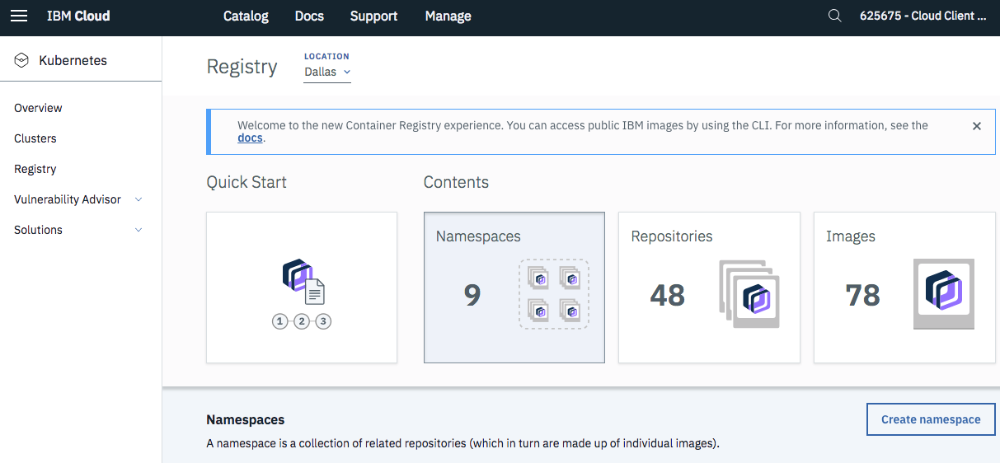
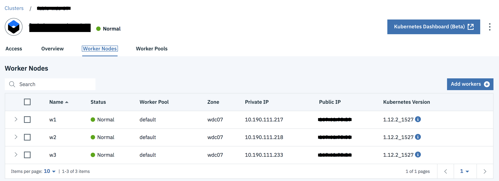

# IKS Deployment

## Prepare IBM Cloud Services to run the solution

IBM Cloud offers a set of services to run part of your event driven architecture. We are using the following services for our reference implementation:
* [Kubernetes Service](https://cloud.ibm.com/containers-kubernetes/catalog/cluster)
* [Streaming Analytics Service](https://cloud.ibm.com/catalog/services/streaming-analytics)
* [Event Streams](https://cloud.ibm.com/catalog/services/event-streams)

At the high level the deployed solution will look like the following:

  

## Pre-requisites

* Create an account on [IBM Cloud](https://cloud.ibm.com).
* Install the following CLIs:
    * [Docker CLI](https://docs.docker.com/install/)
    * [IBM Cloud CLI](https://cloud.ibm.com/docs/cli/reference/ibmcloud/download_cli.html#install_use)
    * IBM Cloud Kubernetes Service [plug-in](https://cloud.ibm.com/docs/cli/reference/ibmcloud/extend_cli.html#plug-ins) using the following command:
      ```sh
      $ ibmcloud plugin install container-service -r Bluemix
      ```
    * [Kubernetes CLI](https://kubernetes.io/docs/tasks/tools/install-kubectl/)
    * IBM Cloud Container Registry plug-in
      ```sh
      $ ibmcloud plugin install container-registry -r Bluemix
      ```

The following diagram illustrates the command lines interface and how they interact with IBM Cloud components:


All our docker images for this solution are in public docker registry: dockerhub under the [`ibmcase` namespace](https://cloud.docker.com/u/ibmcase). This means using our images may work for your deployment if you configure the secrets and other configuration files to point to your services (see detail [in this section](#using-api-keys)) 

It is recommended that you use your own private image repository, so the following section should be performed.

## Define an image private repository

Use the [docker container image private registry](https://console.bluemix.net/containers-kubernetes/catalog/registry) to push your images and then deploy them to IBM Kubernetes Service. When deploying enterprise application it is strongly recommended to use private registry to protect your images from being used and changed by unauthorized users. Private registries must be set up by the cluster admin to ensure that the credentials to access the private registry are available to the cluster users. In the Catalog Use the `Containers` category and `Container Registry` tile. Create the repository with the `create` button. You can share a repository for multi IKS clusters.

Once you access your registry, create a namespace for your solution. We used `ibmcaseeda`. 



We will use this namespace when tagging the docker images for our microservice. But first let add a kubernetes cluster.

## Kubernetes Cluster Service

If you need to know more about kubernetes, read the [basic concepts here](https://kubernetes.io/docs/tutorials/kubernetes-basics/).

To create the cluster follow [this tutorial](https://console.bluemix.net/docs/containers/cs_tutorials.html#cs_cluster_tutorial).

Here is an image of our cluster, with 3 nodes and the smallest configuration:

 

To access to the cluster use the following command:
```sh
# login to IBM Cloud. Do not need to be done each time.
$ ibmcloud login -a https://api.us-east.bluemix.net

# Target the IBM Cloud Container Service region in which you want to work.
$ ibmcloud cs region-set us-east

# You may need to update the CLI, as it changes quite often
$ ibmcloud plugin update container-service

# Set the KUBECONFIG environment variable.
$ export KUBECONFIG=/Users/$USER/.bluemix/plugins/container-service/clusters/fabio-wdc-07/kube-config-wdc07-fabio-wdc-07.yml

# Verify you have access to your cluster by listing the node:
$ kubectl get nodes
```

To set the cluster config to your cluster use: `ibmcloud ks cluster-config <cluster_name_or_ID>`

As it is recommended to ilosate your deployment from kubernetes default setting, create a namespace that can be the same as the container registry namespace name or something else. Below we create the browncompute namespace: `kubectl create namespace browncompute`.


##  Event Streams Service on IBM Cloud

To provision your service, go to the IBM Cloud Catalog and search for `Event Streams`. It is in the Integration category. Create the service and specify a name, a region, and a space. 

* In the service credentials create new credentials to get the Kafka broker list, the admim URL and the api_key needed to authenticate the consumers or producers.

 

 We will use a kubernetes secret to define the api key (see detail [in this section](#using-api-keys))
* In the Manage panel add the topics needed for the solution. We need at least the following:

  


## Streaming Analytics Service

The documentation located [here](https://github.com/ibm-cloud-architecture/refarch-kc-streams#application-development-and-deployment) describes how to configure the IBM Cloud based Streaming Analytics Service and how to build/deploy the example application. 


## Using API keys
The Event streams broker api key is needed to connect any deployed consumers or producers within kubernetes cluster to access the service in IBM Cloud. To avoid sharing the key with public github we propose to define a kubernetes secret and deploy it to the IKS cluster.

The template (file: api-secret-tmpl.yml) for this secret is in the docker folder. Use the following command to deploy the secret into kubernetes cluster under the browncompute namespace:

```
$ kubectl create -f api-secret.yml -n browncompute
```

Verify it is configured:
```
$ kubectl describe secret es-secret -n browncompute
```
> Name:         es-secret  
 Namespace:    browncompute  
 Labels:       <none>  
 Annotations:  <none>  
 Type:  Opaque  
 Data  
 ====  
 apikey:  36 bytes  

The secret will be accessed via environment variable so when defining pod we will add reference to this secret. Something like the following definition:

```
    env:
        - name: KAFKA_APIKEY
            valueFrom:
              secretKeyRef:
              name: es-secret
              key: apikey
```

See an example in the fleet ms [deployment.yml]()
