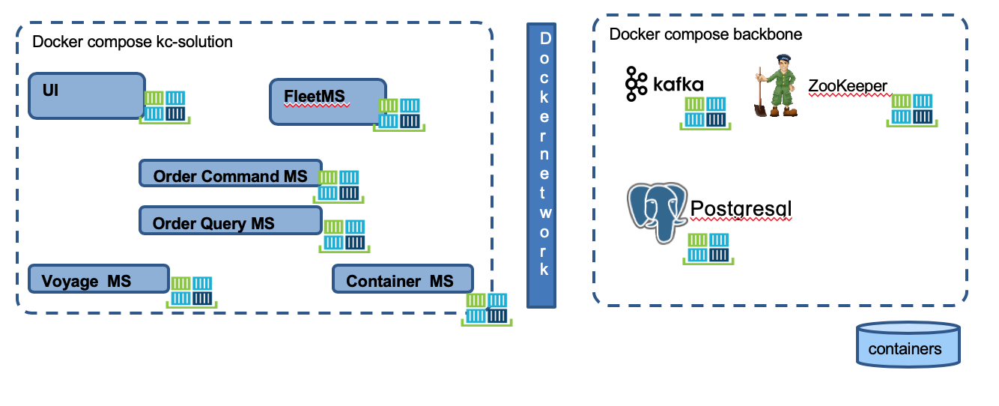
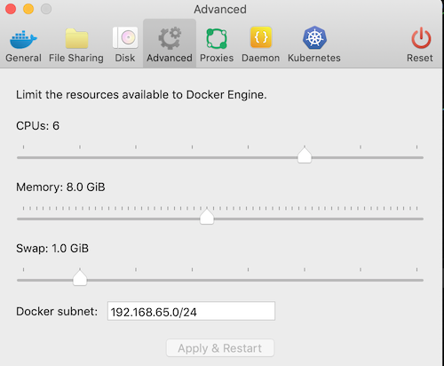

# Run the solution locally with Docker Compose

!!! abstract
    In this document we present how to set up, build and run the solution on your local laptop (Tested on mac) using docker-compose. You need docker and docker compose. 

The environment we put in place looks as the diagram below:



Every microservices run in container and two separate docker compose files define reusable backend services (kafka, zookeeper, postgresql) and the application specific services. The docker-compose files are under the `docker` folder of this project.

## Pre requisites 

Be sure to have done the common pre-requisites from [this note](../pre-requisites.md).

* Get [docker compose](https://docs.docker.com/compose/install/). To verify it runs enter `docker-compose version`. We run version 1.24.
* Assign at least 8GB of memory and may be 4 to 6 CPUs to your docker runtime. This is set in the Docker's Preferences menu and under the `Advanced` tab.



If you are using a linux machine like Centos OS, perform the following to get docker-compose:

Install Extra Packages for Enterprise Linux
```
yum install epel-release
```

Install python-pip
```
yum install -y python-pip
```

Then install Docker Compose:

```
pip install docker-compose
```


* Be sure to have the following hostnames: `kafka1 postgresql fleetms kcui simulator ordercmd orderquery springcontainerms postgres` mapped to `localhost` in your `/etc/hosts` file.  

```
  127.0.0.1	localhost kafka1 postgresql fleetms kcui simulator ordercmd orderquery kcsolution springcontainerms postgres
```


## Start Kafka, Zookeeper and Postgresql

In one Terminal window, under the `refarch-kc` folder, you can start the back end services:

```
pwd
> refarch-kc
./scripts/local/launch.sh BACKEND
```
The local setting use the docker-compose file `backbone-compose.yml` for the backend, with on kafka broker, one zookeeper server and one postgresql. 

If you want to stop the environment use:

```
./scripts/local/stop.sh
```

It will take some time as the script may download zookeeper, kafka and postgresql docker images from dockerhub. When started you should see the following trace:
```
Creating docker_zookeeper1_1 ... done
Creating docker_kafka1_1     ... done
Creating docker_postgresql_1 ... done
Attaching to docker_zookeeper1_1, docker_kafka1_1
....
```
 > Note: Starting those components will create two folders in the docker folder: `kafka1` and `zookeeper1`. Those folders could be deleted to restart from a fresh environment.  

The first time the kafka backbone is started, the launch.sh script will create the topics for the solution. If for any reason you need to add new topic of assess existing Kafka topics run the script: `scripts/createTopics.sh LOCAL`.

If you want to verify the list of topic you can exec on the kafka container. A command like:

```
docker exec -ti docker_kafka1_1 /bin/bash -c "/opt/bitnami/kafka/bin/kafka-topics.sh --list --zookeeper zookeeper1:2181"
```

## Build the solution

This project includes some scripts to help build the full solution once all the repositories are cloned. If you have any problem during this integrated build we recommend going into each project to assess the build process in detail. 

We are using polyglote implementations so if you do not want to overload your own laptop with the different libraries needed, we propose to use docker images to get development environments for nodes, python and java. (Three separate images). This will help you to do not pollute your computer. 
If you want to use those images, run the three commands below: to build the three images (those images are also in docker hub). 

```sh
cd docker
# build the image for java:
docker build -f docker-java-tools -t ibmcase/javatools .
# build the image for nodejs, angular, npm
docker build -f docker-node-tools -t ibmcase/nodetools .
# If already done, build the image for python
docker build  -f docker-python-tools -t ibmcase/python .
```

To validate the current images run `docker images`


> You have two approaches to build the solution, one using a unique command, or one going into each project and follow the local build instructions. From an education point of view we encourage you to do the second approach. 

1. You can build all projects in one command by executing: `scripts/buildAll LOCAL` from this project. This command may use the docker images built previously if they are visible via the command `docker images`. If not it will build using maven, npm and angular cli. Some tests use kafka, we did not isolate well our unit tests yet. So be sure to have kafka running as described in the previous session: [Start Kafka and Zookeeper](#start-kafka-and-zookeeper).
1. Build one project at a time in the following order:
    
      * [Build the fleet simulator microservice](https://github.com/ibm-cloud-architecture/refarch-kc-ms/tree/master/fleet-ms#run). This component is done in java, and exposes API to get fleets and vessels within a fleet and start / stop simulation. Once started, it generates events for the ship movement to simulate vessels crossing the ocean and container metrics to simulate IoT messages sent to kafka. 
      * [Voyage microservice](https://github.com/ibm-cloud-architecture/refarch-kc-ms/tree/master/voyages-ms) to simulate the vessel voyage schedule from one harbor to another.
      * [Order manager services](https://github.com/ibm-cloud-architecture/refarch-kc-order-ms) to support the order management APIs and to publish and subscribe to `orders` topic.
      * [Container manager service](https://ibm-cloud-architecture.github.io/refarch-kc-container-ms/) to manage Reefer container inventory.

Use the `scripts/imageStatus` script to verify your docker images are built:

```
 ibmcase/kc-ui                  latest    c89827424689        15 hours ago        596MB  
 ibmcase/kc-orderqueryms        latest    09406c8795e8        23 hours ago        548MB   
 ibmcase/kc-ordercmdms          latest    5190db45e4bf        23 hours ago        548MB   
 ibmcase/kc-voyagesms           latest    54b8d6a61f4e        23 hours ago       1.16GB   
 ibmcase/kc-fleetms             latest    a5e1d40a8b1f        23 hours ago        616MB   

```

* If you want to delete the docker images after testing the solution, use the command:
`docker rmi $(docker -aq | grep ibmcase)`

## Start all the microservices

1. In a second terminal window, use our second docker compose file to start the web server and the other microservices: 

```
# First set environment variables
$ pwd
../refarch-kc/docker
$ source ../scripts/setenv.sh LOCAL
# Then use docker compose to start all the services
$ docker-compose -f kc-solution-compose.yml up
```
We have also defined a script to start back end and the solution services in one command: `./script/local/launch.sh`.

1. Verify the different components work fine. You can use the different test scripts we have defined in each of the microservice projects or use the following URLs:
  * For the [user interface URL http://localhost:3010](http://localhost:3010)
  * The Fleet Simulator [API URL](http://localhost:9080/api/explorer/) or one of its operation to get the fleet names: [http://localhost:9080/fleetms/fleets](http://localhost:9080/fleetms/fleets).
  * Add an order with the python program under `refarch-kc/itg-tests/OrdersPython` folder, using the script `addOrder.sh`
  * The voyages [http://localhost:3100/voyage](http://localhost:3100/voyage) microservices returns the small list of voyages.
  * Using the order query microservice [http://localhost:11080/orders/byManuf/GoodManuf](http://localhost:11080/orders/byManuf/GoodManuf) you should see the orders of the "GoodManuf" customer.

or run the smoke tests with the script: `scripts/localSmokeTests`.

Read the [demo script](../demo/readme.md) to see how all those components are working together to demonstrate the business process end to end.

## Some tricks

* With docker-compose you can use the command: `docker-compose -f kc-solution-compose.yml down` to stop the solution. You should see the following error message: `ERROR: error while removing network: network docker_default id e867... has active endpoints`. This is normal as the docker network is still running as the backend services are still running. 
* Clean all docker images: `docker rmi -f $(docker images | grep ibmcase | awk '{print $3}')`
* Stop one of the service with docker compose, for example to stop the order command service do: `docker-compose -f kc-solution-compose.yml  stop ordercmd` 
