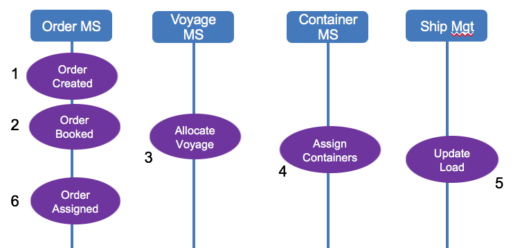

# K Container integration tests

This folder includs a set of tests to validate some of the event-driven microservice patterns like event sourcing with fail over, CQRS and Saga pattern with recovery and fail over.

These code samples are using Python to illustrate how to use Kafka python module from [this github.](https://github.com/confluentinc/confluent-kafka-python)

## How to proof the event sourcing

To validate event sourcing we want to use the order event topic and add some events to cover the full order lifecycle. We want to validate the order events are sequential over time, and it is possible to replay the loading of events from time origin and from a last committed offset.

The tests are under the es-it folder. The tests are done in python, so we can also illustrate how to use kafka python client API. To avoid impacting your environment we use a dockerfile to get the basic of python 3.6 and other needed modules like kafka, http requests... So build your image using the following command under current folder `itg-tests`:

```shell
$ docker build -t ibmcase/python .
```
With this image we will be able to run the different tests. For example the following commands will start a bash shell with the python environment, mounting the local filesystem into the docker /home folder, and connect to the same network as the Kafka broker and other KC solution components are running in:

```shell
$ docker run -v $(pwd):/home --network=docker_default -ti ibmcase/python bash
root@fe61560d0cc4:/# 
```
From this shell we can execute our tests.

```shell
root@fe61560d0cc4:/# python EventSourcingTests.py
```


## How to proof the SAGA pattern

We want to validate the SAGA pattern to support the long-running, cross microservices, order transactions. The diagram is illustrating the use case we want to proof and tests:



What we need to proof for the happy path:
* Send a new order to the order microservice via API with all the data to ship fresh goods from two countries separated by ocean
* verify the status of the order is pending
* The unique cross services key is the order ID
* verify orderCreated event was published
* verify voyage was allocated to order
* verify container was allocated to order
* verify ship has new containers added to its plan shipping plan 
* verify the status of the order is assigned

Business exeception error: no container for this type of load is available in this time frame. So the business response will be to keep the order in pending but trigger a business process for a customer representative to be in contact with the manufacturer for a remediation plan. 

* Verify the response to the container service is an OrderUnfulled event.
